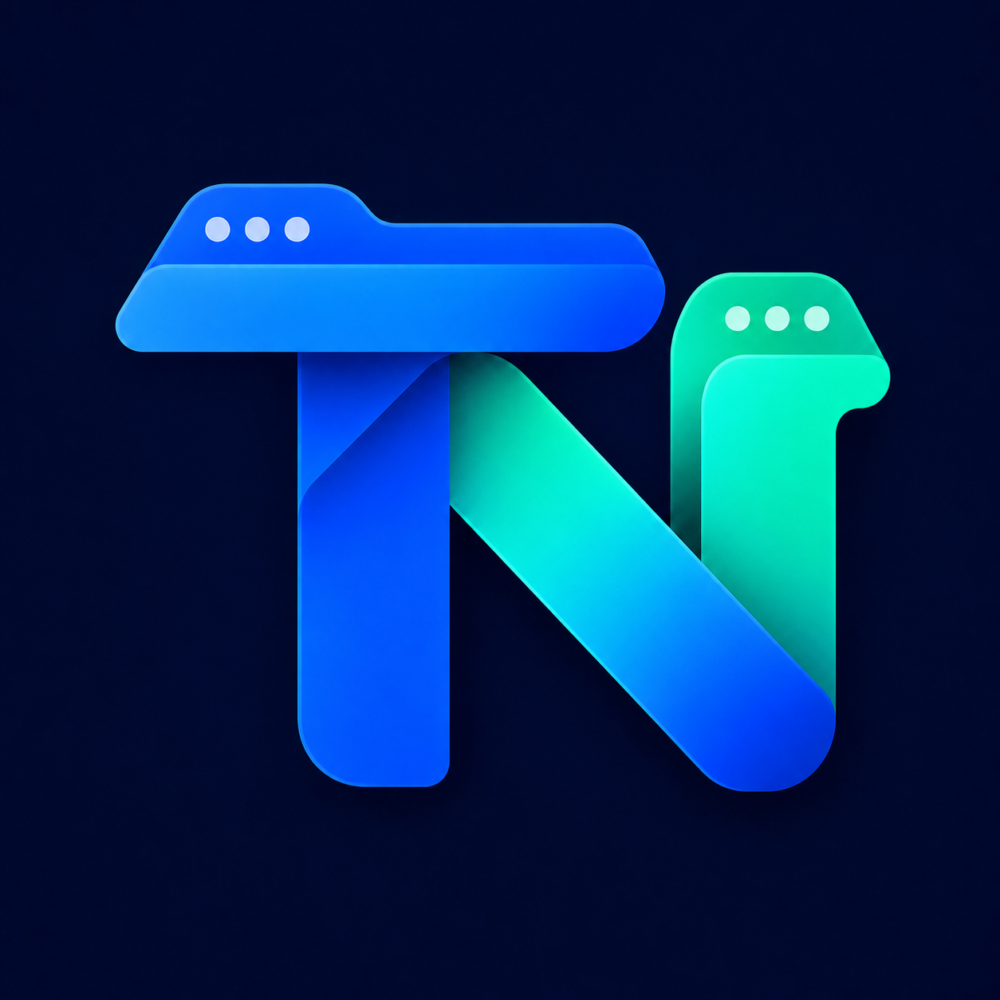

<p align="center">
  
</p>

<h1 align="center">TabNest — Menu Bar Browser</h1>

<p align="center">
  把常用网页收进 macOS 菜单栏，需要时在图标下方即时展开。
</p>

<p align="center">
  <a href="https://github.com/liangix/TabNest/actions/workflows/release.yml"></a>
  <a href="https://github.com/liangix/TabNest/releases/latest"></a>
  
  
  <a href="LICENSE"></a>
</p>

TabNest 是一个原生 macOS 菜单栏浏览器。每个网页拥有独立的浮动面板、站点图标和快捷键，也可以把所有 Tab 收拢到一个应用图标。面板使用常驻 `WKWebView`，收起再打开不会丢失当前页面和登录状态。

纯 Swift 实现，基于 **AppKit + WebKit + SwiftUI**，没有第三方运行时依赖。

## 下载与安装

1. 从 [GitHub Releases](https://github.com/liangix/TabNest/releases/latest) 下载最新的 `TabNest-<version>.dmg`。
2. 打开 DMG，将 `TabNest.app` 拖入 `Applications`。
3. 启动 TabNest，菜单栏会出现站点图标。

当前 Release 使用 ad-hoc 签名，尚未进行 Apple Developer ID 公证。如果 macOS 首次阻止打开，请在 Finder 的“应用程序”中右键 TabNest，选择“打开”并确认。不要从来源不明的位置下载二次打包版本。

系统要求：**macOS 13 Ventura 或更高版本**。Release DMG 包含 `arm64` 与 `x86_64` 双架构，可运行于 Apple Silicon 和 Intel Mac。

## 核心能力

- **菜单栏原生体验**：面板始终停靠在所属图标正下方，拖动缩放时保持居中对齐。
- **展开或收拢**：每个 Tab 可以显示为独立 favicon，也可以收拢为单个 TabNest 图标。
- **预设与 Tab 分离**：关闭 Tab 不会删除预设站点，随时可以从右键菜单重新打开。
- **站点快捷键**：默认使用 `⌥⇧1–9`，支持为每个站点录制自定义全局快捷键或关闭快捷键。
- **可靠的站点图标**：优先读取页面真实 Tab favicon，带缓存与回退策略，避免加载闪烁。
- **浏览器标识**：支持系统 Safari、固定桌面 Safari、移动端 Safari 和自定义 User-Agent；修改后立即重新载入生效。
- **页面缩放**：每个站点独立保存，默认 90%，范围 50%–200%。
- **媒体控制**：支持静音；关闭 Tab 时同步停止音视频和网络加载。
- **网页录音**：HTTPS 页面可以请求麦克风，先确认网页来源，再进入 macOS 系统授权。
- **其他能力**：自动刷新、强制刷新、前进后退、登录态持久化、登录时启动。

## 默认预设

首次安装且不存在旧偏好数据时，TabNest 会创建以下预设并打开为 Tab：

| 站点 | 地址 | 默认浏览器标识 |
|---|---|---|
| Bing | `https://www.bing.com` | 系统 Safari |
| GitHub | `https://github.com` | 系统 Safari |
| YouTube Music | `https://music.youtube.com` | 桌面 Safari |
| ChatGPT | `https://chatgpt.com` | 系统 Safari |

覆盖安装不会重置用户已经维护的预设和 Tab。

## 使用方式

| 操作 | 结果 |
|---|---|
| 左键菜单栏图标 | 展开或收起对应网页面板 |
| 右键 / `⌥` + 左键图标 | 打开站点操作菜单 |
| `Esc` / `⌘W` | 收起当前面板 |
| `⌘R` | 重新载入 |
| `⇧⌘R` | 重新应用 UA 并忽略缓存载入 |
| `⌘[` / `⌘]` | 后退 / 前进 |
| `⌘+` / `⌘−` | 放大 / 缩小页面 |
| `⌘0` | 恢复默认 90% 缩放 |
| `⌥⇧1–9` | 唤起对应顺序的站点 |

右键菜单还可以新建站点、维护预设、切换图标模式、静音、在默认浏览器打开以及设置登录启动。

## 权限与隐私

- 登录状态和站点配置保存在本机，不上传到 TabNest 服务；项目本身不包含远程后端。
- 所有 WebView 使用系统 `WKWebsiteDataStore` 保存 Cookie 和网站数据。
- 网页只能从 HTTPS 来源申请麦克风；每次请求都会显示来源确认，摄像头请求默认拒绝。
- 麦克风系统授权可在“系统设置 → 隐私与安全性 → 麦克风”中撤销。
- 网页尝试唤起未安装的外部 App Scheme 时会被拦截，避免出现系统 URL 弹窗。

## 本地开发

```bash
git clone https://github.com/liangix/TabNest.git
cd TabNest

swift test                       # 运行测试
swift run                        # 开发运行
./scripts/make_app.sh release    # 构建 dist/TabNest.app
open dist/TabNest.app
```

构建通用架构 DMG：

```bash
TABNEST_VERSION=1.0.0 ./scripts/make_dmg.sh release
```

输出文件：

- `dist/TabNest-1.0.0.dmg`
- `dist/TabNest-1.0.0.dmg.sha256`

两个文件位于同一目录时可验证下载完整性：

```bash
shasum -a 256 -c TabNest-1.0.0.dmg.sha256
```

## Release 流水线

`.github/workflows/release.yml` 在推送 `v*` 版本标签时自动执行：

1. 运行完整测试；
2. 构建 Apple Silicon + Intel 通用应用；
3. 生成并验证压缩 DMG；
4. 生成 SHA-256 校验文件；
5. 创建 GitHub Release 并上传两个文件。

```bash
git tag v1.0.0
git push origin v1.0.0
```

也可以从 GitHub Actions 页面手动运行，并指定符合语义化版本格式的标签。

## 项目结构

```text
.
├── Package.swift
├── Resources/AppIcon.png
├── Sources/MenuBarBrowser/       # AppKit / WebKit / SwiftUI 应用源码
├── Tests/MenuBarBrowserTests/    # 模型、WebView 生命周期与资源处理测试
├── scripts/make_app.sh           # 生成并签名 .app
├── scripts/make_dmg.sh           # 生成通用架构 DMG 与校验文件
└── .github/workflows/release.yml # GitHub Release 流水线
```

## Roadmap

- [ ] Developer ID 签名与 Apple 公证
- [ ] 每站点独立网站数据存储
- [ ] 页面内查找

## License

[MIT](LICENSE)
